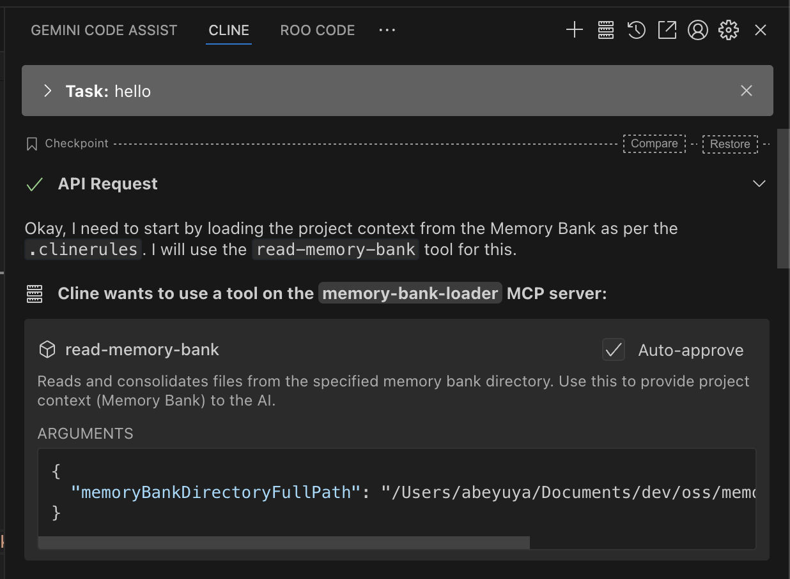

# memory-bank-loader-mcp

This is an MCP server for retrieving all files in the memory-bank directory at once.
Its purpose is to reduce AI tool invocation frequency when loading memory-bank, saving both time and money.



## Features

-   Recursively reads all files within the specified directory (e.g., a 'memory-bank' directory).
-   Sorts files with a specific priority order:
    1.  Root-level files come first.
    2.  Specific priority files (`projectbrief.md`, etc.) within the root are ordered first.
    3.  All other files (non-priority root and all subdirectory files) are sorted alphabetically by relative path.
-   Optimized for providing clear and structured context to AI models.

## Tools

- `read-memory-bank`
  - Read and consolidates files from the specified memory bank directory. Use this to provide project context (Memory Bank) to the AI.
  - **Input:**
    - `memoryBankDirectoryFullPath` (string, **required**): The full, absolute path to the directory containing the memory bank files.
  - **Returns:**
    - Read file list.

## Setup

### NPX

```json
{
  "mcpServers": {
    "memory-bank-loader": {
      "command": "npx",
      "args": [
        "-y",
        "abeyuya/memory-bank-loader-mcp",
      ],
    }
  }
}
```

### Build

```bash
$ npm run build
```

```json
{
  "mcpServers": {
    "memory-bank-loader": {
      "command": "node",
      "args": [
        "/full/path/to/memory-bank-loader-mcp/build/index.js"
      ]
    }
  }
}
```

## License

MIT
